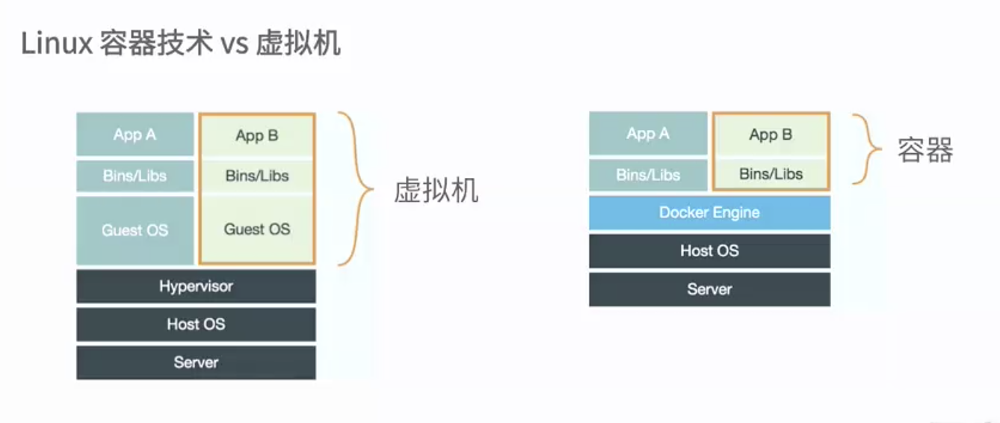
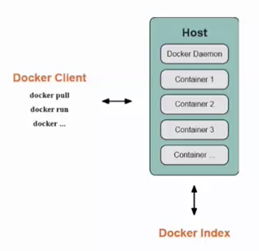
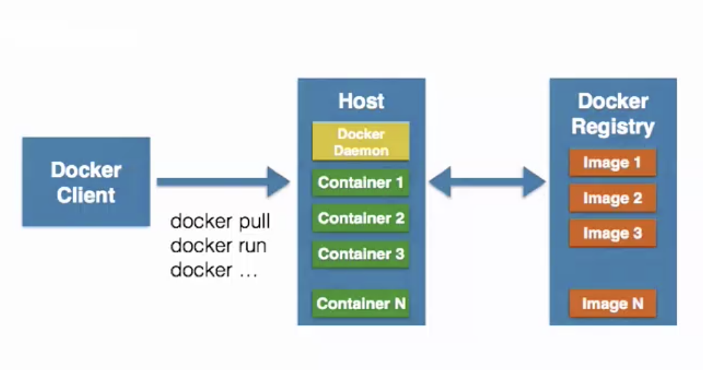

## Docker简介
### 什么是容器
  * 一种虚拟化的方案
  * 操作系统级别的虚拟化
  * 只能运行相同或相似内核的操作系统
  * 依赖于Linux内核特性：Namespace和Cgroups（Control Group）
  

### 什么是Docker
  * 讲英语程序自动部署到容器
  * Go语言开源引擎 [Github地址](https://github.com/docker)
  * 2013年 dotCloud
  * 基于Apache 2.0开源授权协议发行

### Docker目标
  * 提供简单轻量的建模方式
  * 职责的逻辑分离
  * 快速高效的开发生命周期
  * 鼓励使用面向服务的架构

### Dcoker使用场景
  * 使用Docker容器开发、测试、部署服务。
  * 创建隔离的运行环境
  * 搭建测试环境
  * 构建多用户的平台即服务（PaaS）基础设施
  * 提供软件及服务（SaaS）应用程序
  * 高性能、超大规模的宿主机部署

## 基本组成
### Dcoker Client 客户端 / Docker Daemon 守护进程
  * C/S架构
  * 本地/远程
  

### Docker Image 镜像
  * 容器的基石，容器都是基于镜像启动和运行。镜像好比容器源代码。
  * 层叠的只读系统，底层是文件引导系统bootfs。
  * 联合加载（union mount）一次加载多个文件系统，外面只能看到一个，可以有父子镜像。
  * Docker
  |add Apache    |
  |add emacs     |
  |rootfs(Ubuntu)|  <- 基础镜像
  |bootfs        |

### Docker Container 容器
  * 通过镜像启动
  * 当一个容器启动时候，Docker会在镜像最顶层加一个读写文件系统，在docker运行的程序都是在这个层中
  |可写层     |
  |add Apache|
  |add emacs |
  |rootfs(Ubuntu)|  <- 基础镜像
  |bootfs    |
  * 写时复制（copy on write）

### Docker Registry 仓库
  * 公有仓库 DockerHub
  * 私有仓库 

## Docker容器相关技术简介
### Namespaces 命名空间
  * 编程语言 封装 --> 代码隔离
  * 操作系统 系统资源的隔离 进程 网络 文件系统...
-------------------------------
  * PID(Process ID) 进程隔离
  * NET(Network) 管理网络接口
  * IPC(InterProcess Communication) 管理跨进程通信的访问
  * MNT(Mount) 管理挂载点
  * UTS(Unix Timesharing System) 隔离内核和版本标识

### Control groips (cgroups)控制组
  * 用来分配资源
  * 来源google
  * Linux Kernel
-------------------------------
  * 资源限制
  * 优先级设定
  * 资源计量
  * 资源控制
-------------------------------
#### Docker容器能力
* 文件系统隔离：每个容器都有自己的root文件系统
* 每个容器都运行在自己的进程环境中
* 容器间的虚拟网络接口和IP地址都是分开的
* 资源隔离和分组：使用cgroups将CPU和内存之类的资源独立分配至每个Docker容器